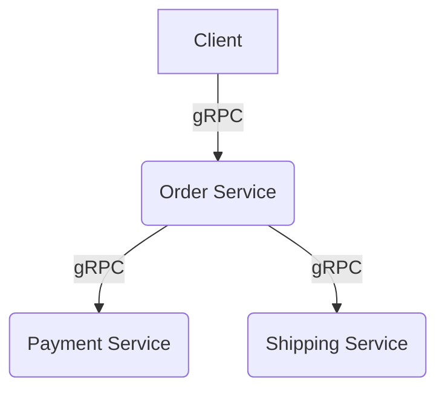

Siap! Berikut adalah satu file `README.md` utuh, lengkap, dan estetik berdasarkan isi dari PDF-mu:

---

```markdown
# 🧩 Create Order Saga with gRPC

Selamat datang di proyek **Create Order Saga** menggunakan arsitektur **Microservices** dan komunikasi antar layanan dengan **gRPC**. Proyek ini dibangun sebagai bagian dari pemenuhan tugas mata kuliah *Pengembangan Web Lanjut (PWL)*.

---

## 📌 Deskripsi Proyek

Proyek ini merupakan simulasi sistem pemesanan produk yang melibatkan beberapa layanan mikro seperti:
- 🛒 **Order Service**: Bertugas mencatat dan memproses pemesanan.
- 💳 **Payment Service**: Menangani proses pembayaran.
- 🚚 **Shipping Service**: Mengelola pengiriman barang.

Ketiga layanan saling berinteraksi menggunakan **gRPC** dan dikoordinasikan menggunakan pola **Saga Pattern** untuk menjaga konsistensi data dalam transaksi terdistribusi.

---

## 🧠 Dasar Teori

### 1. Microservices
Merupakan metode pengembangan perangkat lunak dengan membagi sistem besar menjadi layanan-layanan kecil yang saling terpisah, independen, dan mudah diskalakan.

### 2. gRPC
Framework komunikasi Remote Procedure Call (RPC) modern, cepat, dan ringan yang dikembangkan oleh Google. Menggunakan Protocol Buffers (`.proto`) sebagai IDL (Interface Definition Language), dan mendukung berbagai bahasa pemrograman.

### 3. Saga Pattern
Pola manajemen transaksi terdistribusi yang membagi satu transaksi besar menjadi beberapa langkah kecil dengan kompensasi jika terjadi kegagalan. Saga dapat dijalankan secara:
- **Choreography**: Komunikasi antar layanan tanpa orkestrator.
- **Orchestration**: Komunikasi diatur oleh satu layanan pusat (orchestrator).

---

## 🧱 Arsitektur Sistem



- Semua layanan dijalankan secara lokal pada port yang berbeda.
- Komunikasi terjadi menggunakan gRPC antar service.
- Order Service bertindak sebagai Orchestrator.

---

## 🛠️ Teknologi yang Digunakan

| Teknologi | Deskripsi |
|-----------|-----------|
| Node.js   | Runtime untuk membangun aplikasi backend |
| gRPC      | Komunikasi antar service |
| Protocol Buffers | Format serialization untuk definisi layanan |
| JavaScript | Bahasa pemrograman utama |
| Postman | Pengujian endpoint gRPC |

---

## 📁 Struktur Proyek

```
create-order-saga/
├── order-service/
│   ├── order.proto
│   ├── server.js
├── payment-service/
│   ├── payment.proto
│   ├── server.js
├── shipping-service/
│   ├── shipping.proto
│   ├── server.js
├── client/
│   └── client.js
├── protos/
│   └── *.proto (jika dipusatkan)
```

---

## 🚀 Cara Menjalankan Proyek

### 1. Clone Repository
```bash
git clone https://github.com/AlfonsoPangaribuan/create-order-saga.git
cd create-order-saga
```

### 2. Install Dependencies
```bash
npm install
```

### 3. Jalankan Setiap Service di Terminal Berbeda
```bash
# Terminal 1 - Order Service
node order-service/server.js

# Terminal 2 - Payment Service
node payment-service/server.js

# Terminal 3 - Shipping Service
node shipping-service/server.js
```

### 4. Jalankan Client
```bash
node client/client.js
```

---

## 🧪 Contoh Output

```bash
Order Service: Received CreateOrderRequest
Payment Service: Payment Processed
Shipping Service: Shipping Processed
Order Service: Order successfully created!
```

---

## 🎯 Tujuan Proyek

- Mengimplementasikan komunikasi antar microservices menggunakan gRPC.
- Mengaplikasikan konsep Saga Pattern untuk menjaga konsistensi data.
- Membangun sistem pemesanan sederhana berbasis Node.js.

---

## ✍️ Kontributor

👤 **Alfonso Pangaribuan**  
📚 NIM: 122140206  
🎓 Teknik Informatika, Institut Teknologi Sumatera  
📘 Mata Kuliah: Pengembangan Web Lanjut
